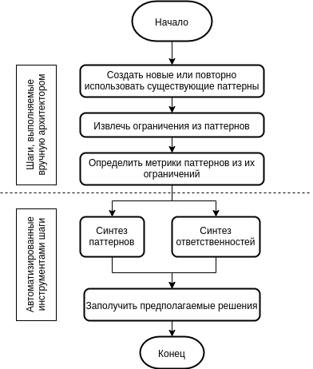
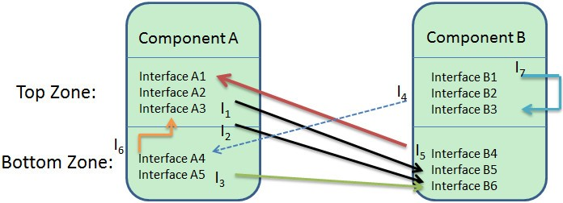

Автоматический синтез архитектуры программного обеспечения с помощью паттернов: кооперативный коэвлюционный подход.
====================================================================================================================
Юн Руи Х., Пэнг Линг
Ухань, Китай

:bibtex-file: links.bib
:figure-caption: Рисунок
:table-caption: Таблица
:stem: latexmath
:eqnums: all

[abstract]
В процессе проектирования архитектуры программного обеспечения, проектировщик использует архитектурные паттерны, как повторно используемые знания для синтеза архитектуры. Однако, наблюдается, что получаемая в результате архитектура не соответствует изначально поставленным целям, для которых применялся архитектурный шаблон. Проектирование архитектуры с использованием архитектурных паттернов представляется сложной задачей, особенно для начинающего архитектора из-за нехватки опыта. В этой статье мы предлагаем кооперативный коэволюционный подход для автоматизации архитектурного синтеза с использованием архитектурных паттернов. Сперва проанализируем несколько архитектурных паттернов и накладываемые ими ограничения. А затем расширим уже сформировавшийся архитектурный синтез теми паттернами, что получены в результате анализа. Также рассмотрим процесс определения метрик паттернов, используемых для автоматизации архитектурного синтеза, основываясь на ограничениях паттернов. В итоге получим отображение расширенного синтеза архитектуры на кооперативную коэволюционную модель, которая позволяет оптимизировать полученное архитектурное решение и избежать нарушения ограничений паттерна.

== Введение 

Большие программные системы состоят из большого количества компонентов. взаимодействующих между собой весьма сложным образом. Чтобы снизить сложность при проектировании архитектуры программного обеспечения архитекторы полагаются на набор идиоматических архитектурных паттернов, как комплекс архитектурных решений, который однозначно идентифицируется и неоднократно применяется на практике cite:[Bass12].

Использование архитектурных паттернов для синтеза архитектуры извлекает много пользы и превращает проектирование архитектуры в комбинирование архитектурных паттернов cite:[Bass12,Buschmann96]. По этой причине существует много работ, посвящённых выбору подходящего паттерна.из репозитория паттернов в определённом контексте проектирования учитывая критерии качества в архитектурном синтезе cite:[Babu11,Galster10]. Однако многие исследователи замечают, что полученная в результате архитектура системы не всегда отвечает изначально поставленным требованиям, для которых применялся паттерн, и которым руководствовались в начале проектирования cite:[Belle13]. Причина тому кроется преимущественно в том, что:
во-первых, существующие труды сконцентрированы на рекомендациях по выбору паттернов, но уделяют мало внимания концептуальному пробелу между абстрактными элементами и модулями реализации используемого паттерна; во-вторых, каждый паттерн имеет набор ограничений проектирования при их использовании, и архитектор может использовать паттерн без осведомления ограничений или с неправильной их интерпретацией в связи с недостатком опыта (в частности это касается начинающих архитекторов). Если ограничения требований не выполняются, то архитектору, возможно, придётся перепроектировать архитектуру для того, чтобы избежать негативных последствий на качество системы. В итоге большинство существующих трудов направлено на "выбор и рекомендацию архитектурных паттернов" вместо "интерпретации архитектурных паттернов", что есть частью архитектурного синтеза cite:[Tang10]. И эти работы не направляют на путь элегантного расположения компонентов и связей во избежание нарушений ограничений паттерна.

С другой стороны, архитектурный синтез сильно зависит от опыта архитектора, особенно, когда пространство проектирования экспоненциально расширяется с ростом масштаба системы. Много подходов было предложено для автоматизации процесса исследования и эксплуатации пространства проектирования cite:[Aleti13]. Большинство из них использует технику программной инженерии, основанной на поиске (SBSE) либо проектирования программного обеспечения, основанную не ней (SBSD) cite:[Harman12]. Однако, как отмечено в cite:[Harman12], несмотря на то, что большее количество аспектов программной инженерии годятся для оптимизации по коэволюционной модели, удивителен тот факт, что небольшая работа, совершаемая по коэволюционной модели касается проблем программной инженерии. Одной из этих проблем является архитектурный синтез.

с этой целью мы предлагаем кооперативный коэволюционный подход, который направлен на автоматический синтез архитектурных решений, основанных на паттернах. Этот подход пытается избежать нарушения ограничений паттернов при рассмотрении распределения обязанностей в полученном архитектурном решении. В нашем подходе сперва расширяется процесс классического архитектурного синтеза, который в сущности связывает множество проблем с множеством решений проектирования архитектуры, состоящий из двух частей: шаги, выполняемые вручную архитектором; и автоматизированные шаги с помощью инструментов. Затем выясним ограничения существующих архитектурных паттернов, и определим метрики паттернов, основанные на этих ограничениях для того, чтобы определить фитнесс-функцию для автоматического синтеза архитектуры с помощью инструментов. Как было сказано выше по тексту, когда кандидатское архитектурное решение синтезировано, имеются две характеристики (т.е. устранение нарушения ограничений паттернов и распределение обязанностей среди архитектурных элементов). Каждая характеристика соотносится с одной популяцией (набором решений). Когда две характеристики коррелируют не особо, их популяции коэволюционируют для лучшего взаимодействия, что приносит огромную пользу архитектурному синтезу cite:[Harman12]. Таким образом, проблема автоматизации архитектурного синтеза превращается в оптимизационную проблему кооперативной коэволюции. Покажем, как предлагаемый подход может помочь архитектору расположить компоненты и связи с минимальными нарушениями ограничений, чтобы реализовать архитектурные паттерны в определённом контексте проектирования. Вклад данной работы заключается в (1) определении и применении метрик паттернов для измерения нарушений ограничений паттернов в архитектурном проектировании, и (2) превращение архитектурного синтеза, основанного на паттернах, в задачу кооперативной коэволюции, которая может быть автоматизирована.

Остаток данной статьи организован следующим образом. Второй раздел детально вводит читателя в подход к оптимизации синтеза архитектуры. Третий раздел описывает паттерн Myx, который применяется в ArchStudio cite:[Garcia13], как пример для объяснения нашего подхода. Связанные труды обсуждены в четвёртом разделе, а пятый раздел заключает повествование и очерчивает будущие направления исследований.

== Подход

В этом разделе сперва проанализируем некоторые общие архитектурные паттерны и ограничения их использования. Затем расширим классический синтез архитектуры, представленный в cite:[Hofmeister07] до паттерно-ориентированного архитектурного синтеза. Также охарактеризуем процесс определения метрик паттернов в подробностях для того, чтобы улучшить применяемость нашего подхода, когда архитекторы используют свои собственные паттерны, не изложенные в данной статье. Процесс определения позволяет архитекторам определить метрики паттернов из их ограничений. В конце переложим расширенный архитектурный синтез на кооперативную коэволюционную модель, которая стремится устранить нарушения ограничений паттернов при автоматическом распределении ответственностей среди архитектурных элементов. Предлагаемый подход делает полученную архитектуру соответствующей исходным потребностям, положенным в основу выбора паттернов проектирования, распределяя обязанности среди архитектурных элементов во время архитектурного синтеза.

.Диаграмма деятельности расширенного синтеза архитектуры

=== Расширенный синтез архитектуры

Общий процесс проектирования включает три деятельности: архитектурный анализ, синтез, и эволюцию cite:[Hofmeister07], в которых классический  архитектурный синтез (АС) предлагает набор претендентских архитектурных решений (т.е. архитектурных паттернов) обращенных к архитектурно-значимым требованиям (АЗТ), определяемым на протяжении архитектурного анализа. В сущности синтез архитектуры связан с проблемой пространства решений архитектурного проектирования. Однако, способ предложения архитектурных решений в наборе АЗТ сильно зависит от опыта архитектора в классическом АС, и еще больше ухудшает ситуацию то, что нет доступного и пошагового руководства для решения данной задачи архитектором. Для того, чтобы снизить вероятность ошибки в АС (из=за недостатка опыта) мы вводим расширенный АС для архитекторов.

Как показано на рис. 1, алгоритм расширенного АС делится на две части: шаги, выполняемые вручную архитектором и автоматизированные шаги с помощью инструментов. _Результатом архитектурного анализа (АА) является набор функциональных требований и АЗТ_. и архитекторам нужно выбирать или создавать подходящие паттерны, чтобы обратиться к ним в архитектурном синтезе. Достоинством нашего подхода, в отличие от других способов использования архитектурных паттернов, является то, что он сконцентрирован на ограничениях паттерна в его реализации. Архитекторы могут использовать определяемые для общих паттернов ограничения или определить ограничения для собственных паттернов. Следующий этап данного подхода -- архитекторы определяют метрики паттернов на основе ограничений. В данной статье предоставим для примера метрики паттерна MVC, и опишем процесс определения метрик на основе ограничений для архитектором, которые собираются использовать другие паттерны. Как видно на рис. 1, автоматизированная часть расширенного АС начинается сразу после определения метрик паттернов. Эта часть процесса состоит из двух подпроцессов: _синтез ответственности_ (СО) и _синтез паттернов_ (СП), где под ответственностями подразумевается функциональные требования, подлежащие реализации. В СО функциональные требования используются в качестве входных данных, и этот подпроцесс рассматривает ответственности системы только в ключе того, что система должна делать. В отличие от СО, подпроцесс СП независим от бизнес контекста и фокусируется лишь на реализации паттерна. На его вход подаётся метрика паттерна, используемые им для составления фитнесс-функции минимизации нарушений ограничений паттернов. СО и СП автоматизированы и выполняются одновременно, и они формируют кооперативную коэволюционную модель оптимизации. Преимущество разрозненности СО и СП в том, что СП независим от бизнес-контекста, а СО концентрируется на функциональных аспектах системы. Следовательно, данным подходом мы следуем принципу "разделяй и властвуй" в архитектурном синтезе чтобы реализовать принцип "разделения ответственностей" cite:[Buschmann96].

=== Ограничения и метрики архитектурных паттернов

Архитектурный паттерн состоит из тройки {контекст, проблема, решение}. В cite:[Bass12] Басс и др. уточнили дальнейшую структуру решения, что состоит из пяти частей: обзор, элементы, связи, ограничения и слабости. Ограничения паттерна играют важную роль в установлении предела возможных реализаций паттерна. Однако, на практике архитекторы могут решить нарушить некоторые ограничения для того, чтобы достигнуть компромисса среди двух факторов, таких как атрибуты качества системы и стоимость реализации. Это основная причина того, что полученная архитектура не всегда отвечает исходным паттернам, направляющим процесс проектирование в начале cite:[Belle13].

Важности ограничений проектирования отдали должное в cite:[Brooks10] и она представлена сущностью первого класса в размышлении об архитектурном проектировании cite:[Tang09]. Следовательно, мы представляем ограничения паттернов, разновидность ограничений проектирования, как первоклассную сущность при использовании паттернов в архитектурном синтезе. Нужно ответить на вопрос: _как представлять ограничения паттернов при использовании архитектурных паттернов?_ Выберем несколько широко-применимых архитектурных паттернов, и проанализируем их ограничения, основываясь на определении паттернов в cite:[Bass12,Buschmann96]. Подытожим ограничения нескольких общих архитектурных паттернов в табл. 1.

[cols="<1,5"]
.Ограничения общих архитектурных паттернов
|====
| Паттерн | Ограничения
.5+| Модель-вид-Контроллер (MVC) | Должен быть хотя-бы один экземпляр каждого элемента паттерна, т.е. модель, вид, контроллер.
| Модель не должна взаимодействовать непосредственно с контроллером
| Каждому экземпляру модели должен соответствовать хотя-бы один вид
| Каждый вид должен быть связан хотя-бы с одной моделью
| Между видами и контроллерами связь один-к-одному
.4+| Школьная доска | Должен быть хотя-бы один экземпляр каждого элемента паттерна, т.е. доска, источник знаний, контроллер.
| Контрольные данные и промежуточные решения записываются на доске, а источники знаний получают доступ к данным через интерфейс доски 
| Источники знаний должны быть независимы друг от друга
| Вокруг себя, каждому источнику знаний доступна только доска
.3+| Труба и фильтр | Труба и фильтр может быть соединена непосредственно только с противоположным ей типом (т.е. фильтром и трубой соответственно).
| Для упрощения связи между компонентами ограничивают до ациклического графа или линейной последовательности
| Фильтр может быть активного или пассивного типа
.4+| Рефлексия | Имеется, как минимум, два уровня, включая метауровень и базовый уровень.
| Компоненты базового уровня могут взаимодействовать с другими через метаобъекты на метауровне
| Системные аспекты, от которых ожидается стабильность, не должны быть на метауровне
| Метаобъект не позволяет компоненту базового уровня модифицировать его промежуточное состояние
.4+| Слой | Каждая деталь системы располагается на одном и только одном уровне
| Имеется по крайней мере два уровня
| Допустимые к использованию связи не должны быть циклическими
| Количество связей между компонентами, проходящих через подмножество слоёв, должно быть незначительным по сравнению с числом зависимостей между смежными слоями. 
|====

Для того, чтобы оценить качество претендующего архитектурного решения, сгенерированного автоматическим архитектурным синтезом, нам необходимо определить метрики паттернов, которые используются для измерения атрибутов качества решения из ограничений паттернов. Благодаря пространству пределов метрики паттернов определяется лишь из ограничений для одного паттерна: MVC, к примеру, поскольку он является одним из известнейших паттернов в архитектурном проектировании. В следующем подразделе введём процесс определения метрик паттернов.

В интерактивном приложении важно отделять изменения пользовательского интерфейса от остальной системы. Для этой цели служит паттерн MVC, который разделяет функциональность системы на три типа компонентов: модель вид и контроллер, которые лежат в основе приложения при использовании паттерна MVC. Таким образом, определим метрику _LegalMVC_, чтобы судить о степени удовлетворения решения ограничению (1) паттерна MVC (как показано в табл. 1). Для ограничения (2) определим метрику _ControllerUse(m)_, где stem:[m] -- заданная модель, для элемента которой подсчитывается число связей с элементом контроллера. Для ограничения (3) определим метрику _CorecpondingViewUse(m)_, чтобы подсчитать число уведомлений об изменениях от модели _m_ ко всем представлениям, которые ему соответствуют. Примечательно, что если для ограничения (2) элементы модели зависят от элементов контроллера, это имеет негативные последствия на модифицируемость, портируемость и повторную используемость архитектурных элементов. Поэтому для некоторых метрик, таких как _ControllerInUse(m)_, которые сильно влияют на атрибуты качества, следует отдать им больший вес (чем больше вес, тем больше влияние при вычислении ограничений). Формула (1) определяет стоимость модели (MC) для элемента stem:[i], чтобы вычислить стоимость нарушений ограничений для элемента stem:[i], где stem:[i] относится к типу модели в MVC, stem:[\alpha] и stem:[\beta] -- это веса. Поскольку _ControllerUse_ имеет больший вес, чем _CorrespondingViewUse_, устанавливается stem:[\alpha << \beta]. По формуле (1) стоимость данного элемента модели зависит от его связей с элементами представления и контроллера.

[stem]
++++
\begin{aligned}
MC(i) &= \alpha \cdot CorrespondingViewUse(i) \\
      &+ \beta \cdot ControllerUse(i)
\end{aligned}
++++
где stem:[\alpha < \beta].

Подобно определению метрики для элемента модели, для заданного представления stem:[v] также существует две метрики: для ограничения (4) определим метрику _CorrespondingModelUse(v)_, в которой stem:[v] представляет заданное предствление, которая подсчитывает количество отношений состояние-запрос между представлением stem:[v] и соответствующих ей моделям; в то же время определим метрику _ControllerUse(v)_, чтобы подсчитывать число взаимосвязей между stem:[v] и его контроллерами. Для ограничения (5) определим метрику _CorrespondingControllerNumber(v)_ для заданного представления stem:[v], чтобы удостовериться в том, что связь один-к-одному между stem:[v] и его контроллерами. Для элемента представления stem:[i] определим стоимость представления (VC) так же как и прежде определили стоимость модели.

[stem]
++++
\begin{aligned}
VC(i) &= \alpha \cdot CorrespondingModelUse(i) \\
      &+ \beta \cdot ControllerUse(i) \\
      &+ \gamma \cdot CorrespondingControllerNumber(i)
\end{aligned}
++++
где stem:[\alpha < \gamma] и stem:[\beta < \gamma].

В добавок, для элемента контроллера stem:[c]  определим метрику _CorrespondingModelUse(c)_, чтобы подсчитать сообщения, меняющие состояние, от stem:[e] к соответствующих ему моделям. Таким же образом, две метрики _CorrespondingViewNumber(c)_ и _ViewUse(c)_ определены для элементов контроллера. По аналогии с MC и VC определим стоимость контроллера (CC) для заданного обособленного элемента контроллера stem:[i] в паттерне MVC:

[stem]
++++
\begin{aligned}
CC(i) &= \alpha \cdot CorrespondingModelUse(i) \\
      &+ \beta \cdot ViewUse(i) \\
      &+ \gamma \cdot CorrespondingViewNumber(i)
\end{aligned}
++++
где stem:[\alpha < \gamma] и stem:[\beta < \gamma].

Для того, чтобы оценить качество различных решений-кандидатов в автоматическом синтезе паттернов, нужно вычислить фитнесс-функцию для данного MVC решения. Если _LegalMVC_ ложно для одного решения, значит это решение не приемлемо, и фитнесс-показатель просто устанавливается в stem:[\infty]. Если же оно истинно, то фитнесс-показатель вычисляется путём суммирования собственных стоимостей каждого элемента модели, представления и контроллера. Пусть решение состоит из stem:[r] моделей, stem:[s] представлений и stem:[t] контроллеров.

[stem]
++++
Fitness(sol) = \begin{cases} \alpha \cdot \sum_{i=1}^r MC(i) + \beta \cdot \sum_{i=1}^s VC(i) + \gamma \cdot \sum_{i=1}^t CC(i) & LegalMVC = true \\ \infty & LegalMVC = false \end{cases}
++++

Как можно заметить в примере для MVC, оценка нарушений ограничений паттернов зависит от определения метрик паттернов из их ограничений. Поскольку качество метрик паттернов сильно отражается на синтезе паттернов, опишем процесс определения метрик паттерна детальнее в следующем подразделе. Так что теперь архитекторы смогут определить метрики для особых архитектурных паттернов.

=== Процесс определения метрик паттернов

Процесс определения метрики паттерна включает три шага (выяснение роли паттерна, выяснение связей внутри паттерна и выяснение связанные с доменом метрик), которые описаны ниже по тексту:

. _Выяснение роли паттерна._ Как паттерн предоставляет общее решение повторяющейся проблемы: решение, которое может быть реализовано многими путями без необходимости дважды повторятся cite:[Buschmann07], и нет настраиваемой общей реализации, которая покрывала бы всё пространство проектирования. Впрочем, каждый паттерн играет свою неизменную роль, подобно модели, представлению и контроллеру в паттерне MVC. Следовательно, можно идентифицировать некоторые метрики из роли паттерна. Этот шаг включает несколько этапов:
.. Определите метрику верхнего и нижнего предела относительно каждой роли из ограничения паттерна. К примеру, в паттерне Слои определяется _LegalLayers_ чтобы убедиться в том, что слоёв больше, чем один.
.. Определите метрику о соотношении количества меду различными ролями из ограничений паттерна. К примеру, для MVC определим метрики _CorrespondingControllerNumber(v)_ и _CorrespondingViewNumber(c)_.
.. Определить метрики, касающиеся типа ролей из ограничений паттернов  К примеру, есть активный и пассивный фильтр в паттерне Труба-Фильтр, и различие типов фильтров может повлиять на атрибуты качества системы (напр. производительность). Определим метрики _PassiveFilterNumber_ и _ActiveFilterNumber_ для двух типов фильтров из паттерна Труба-Фильтр.
.. Определить метрику, касающуюся ответственности ролей из ограничений паттернов. К примеру, согласно описанию ограничения (2), в паттерне Доска частичное решение извлекается из каждого источника знаний и управляющие данные должны быть сохранены в роли доски. Определим метрику _ImproperDataNumber_, чтобы подсчитывать данные, неуместно сохраненные вне доски.
.. Определите метрику, касающуюся отношений сопоставления для компонентов и ролей шаблонов. В некоторых паттернах один компонент может играть несколько ролей или наоборот. Например, один компонент в паттерне Доска может играть роль доски и контроллера одновременно, что приводит к связыванию данных с управляющей логикой. Поэтому мы определяем метрику PureBlackboard для каждой доски в шаблоне Доска.
. _Выясните отношения внутри паттерна._ Каждый шаблон содержит в себе набор взаимодействий между ролями.  На этом этапе мы определяем метрики из взаимодействий. Она включает в себя следующие подэтапы:
.. Определите метрику для направления взаимодействия. Взаимодействие между различными ролями в шаблоне обычно однонаправленное, например, нижний слой не должен обращаться к верхнему слою в шаблоне слоя, а элементы модели не могут зависеть от элементов контроллера в шаблоне MVC.
.. Определите метрику для взаимодействия циклов. Этот подэтап аналогичен предыдущему подэтапу, но он более сложен, поскольку циклическое взаимодействие часто включает более двух ролевых элементов.
.. Определите метрики об ограничениях отношений между различными ролями. Например, для ограничения (1) канала и фильтра (как показано в Таблице 1), отношения между различными ролями часто ограничены в ограничениях шаблона, которые должны быть определены в метриках шаблона.
.. Определите метрики типов отношений. Существует множество типов отношений между двумя элементами в шаблоне, таких как наследование, реализация, ассоциация и т. д. Поскольку различные типы отношений могут по-разному влиять на атрибуты качества, мы определяем конкретные метрики для типов отношений.
.. Определите метрики для механизмов взаимодействия. Существует множество механизмов взаимодействия между элементами в шаблоне (например, события или сообщения), мы должны рассмотреть механизмы взаимодействия в шаблонах и определить метрики для них.
. _Выведайте метрики, связанные с доменом._ Каждая область имеет свои специфические знания, например, документированные в литературе и стандартах. Аналогично, каждое программное обеспечение имеет свои собственные принципы применения. На этом этапе архитекторы определяют метрики в соответствии с принципами предметной области и приложения.

Результаты этого процесса определения формируют отправную точку для автоматизированного архитектурного синтеза. Когда этот процесс заканчивается, ручная работа архитекторов завершается, как показано на Рис. 1. Метрики паттернов, полученные в ходе этого процесса определения, используются для построения функции пригодности для автоматического синтеза паттернов.

=== Автоматизированный Архитектурный Синтез

Как обсуждалось в разделе 2.1, с расширенным шаблоном, основанным на AS, архитекторы могут предлагать архитектурные решения, используя шаблоны либо сами (например, основываясь на своем опыте), либо через рекомендации по шаблонам cite:[Kassab11]. Тем не менее, как распределить обязанности между элементами проектирования архитектуры в подпроцессе СО и как сгруппировать элементы для реализации архитектурного шаблона в подпроцессе СП -- Это сложные задачи на практике. Решение обеих этих задач во многом зависит от опыта архитекторов. Автоматизация деятельности АС полезна тем, что (1) она позволяет оценить рациональность распределения ответственности на архитектурные элементы; и (2)позволяет избежать нарушения в определенной степени ограничений шаблона автоматически. Кроме того, при проектировании архитектуры больших и сложных систем большинство проблем проектирования может иметь огромное количество возможных решений, которые невозможно исследовать вручную. С этой целью мы решили использовать масштабируемую методику мета-эвристического поиска, чтобы помочь автоматизировать использование шаблонов.

В нашей недавней работе cite:[Xu14] мы формально определили проблему автоматизированного архитектурного синтеза на основе паттернов. В нашем подходе результат подпроцессов СО и СП рассматривается как две популяции решений, которые развиваются одновременно, и приспособленность каждого индивида в одной популяции зависит от статуса индивидов в другой популяции, т. е. две популяции имеют кооперативные коэволюционные отношения cite:[Harman12]. Поэтому целесообразно и целесообразно моделировать модель на основе паттерна как кооперативную задачу оптимизации коэволюции,которая может быть выполнена автоматически для синтеза возможных архитектурных решений.

Выбор представлений для задач сотрудничества и определения функций приспособленности для индивидов в различных популяциях являются двумя составляющими кооперативной коэволюции. В подпроцессе СО (синтез ответственности), с одной стороны, основное решение заключается в том, должен ли архитектурный элемент взять на себя определенную ответственность. Мы используем схему кодирования двоичных строк из методов представления SBSE cite:[Harman12] для представления ответственности, которая возлагается на определенные архитектурные элементы. С другой стороны, поскольку существуют некоторые зрелые метрики, связанные с проблемой распределения ответственности, которые формируют хороших первоначальных кандидатов для функции пригодности СО (например, метрики когезии и сцепления), мы непосредственно используем эти метрики для СО в совместной коэволюции. В подпроцессе СП мы рассматриваем, какую конкретную роль архитектурный элемент играет в этом шаблоне, и используем одну цифру (0--9) для представления типа роли. Затем мы используем метрики паттерна, определенные для каждого ограничения паттерна, как функцию пригодности СП в кооперативной коэволюции. Из-за ограниченности пространства представления для популяций СО и СП и функции пригодности для оценки этих двух популяций подробно описаны в cite:[Kassab11].

== Пример

В этом разделе мы используем архитектурный шаблон Myx, который используется в ArchStudio cite:[Garcia13], в качестве примера, чтобы объяснить использование предлагаемого нами подхода.

=== Ограничения Архитектурного Шаблона

Опустим детали модели Myx, которые можно найти в cite:[Myx], из-за ограничений пространства. Опишем только основные ограничения этого шаблона: (1) Каждый компонент имеет две зоны (т. е. верхнюю и нижнюю), и все интерфейсы, принадлежащие компоненту, должны быть назначены любой из этих двух зон. В любых отношениях вызова или зависимостей, если один интерфейс назначен верхней зоне одного компонента, другой интерфейс в том же отношении должен быть назначен нижней зоне другого компонента, или наоборот (следовательно, в шаблоне Myx верхняя и нижняя зоны каждого компонента являются ролями шаблона); (2) циклические вызовы (т. е. один вызов из Верхней зоны компонента в нижнюю зону того же компонента) не допускаются (существует ли циклический вызов определяется группировкой архитектурных элементов; (3) допускаются только восходящие синхронные вызовы, в которых направление вызова находится от верхней зоны одного компонента к нижней зоне другого компонента, в то время как асинхронные вызовы не имеют никаких ограничений, т. е. допускаются либо восходящие, либо нисходящие асинхронные вызовы (направление вызова также зависит от группировки архитектурных элементов).

=== Метрики из ограничений шаблона

Существующие метрики когезии и сцепления (примеры в cite:[Bowman10,Simons10]) выступают первоначальными кандидатами для функции пригодности в подпроцессе СО. В данном радразделе мы сосредоточимся на метриках из ограничений паттернов для функции пригодности в подпроцессе СП. Чтобы использовать эти метрики, мы должны определить отношения "выше" или "ниже" между двумя компонентами. Мы предлагаем эвристический подход, чтобы решить, какой компонент между двумя компонентами будет "выше". Для каждого компонента вводится свойство "счетчик". Когда происходит вызов из Верхней зоны компонента A в нижнюю зону другого компонента B, мы увеличиваем счетчик B на 1. В противном случае, если вызов происходит из нижней зоны компонента A в верхнюю зону компонента B, увеличивается счетчик A. Наконец, мы сравниваем значения счетчиков в двух компонентах, и компонент, который имеет большее значение счетчика, рассматривается как компонент, который "выше". Например, значения счетчиков компонентов A и B равны 1 и 3 соответственно, как показано на Рис. 2, а затем компонент B становится "выше" компонента A.

В соответствии с процессом определения, описанным в разделе 2. C, мы определяем набор метрик, указанных ниже, на основе ограничений шаблона Myx, представленного в разделе 3.1:
. _IntraUse (i)_: поскольку циклические вызовы не разрешены, компонент никогда не может быть выше или ниже себя в отношениях вызова. Эта метрика измеряет число отношений вызова, два связанных интерфейса которых находятся в одном компоненте i, нарушающем ограничение (2).
. _IllegalUse (i, j)_: эта метрика обозначает количество отношений вызова между компонентами i и j, которые нарушают ограничение (1).
. Intra\&IllegalUse (i): эта метрика аналогична IntraUse(i). Разница между двумя метриками заключается в том, что эта метрика учитывает отношения вызова, которые два связанных интерфейса находятся не только в одном компоненте i, но и в одной зоне. Он измеряет количество отношений вызова, которые нарушают как ограничение (1), так и ограничение (2).
. _ComplexUse (i, j)_: согласно ограничению (3), нисходящий вызов разрешен только для асинхронных вызовов. При разработке программного обеспечения на основе компонентов асинхронные вызовы могут усложнить проектирование системы, что трудно понять. Метрический комплекс (i, j) обозначает количество асинхронных вызовов между компонентами i и j. он косвенно измеряет сложность конструкции.
. _CycleUse (i, j)_: когда компонент i находится выше компонента j в отношениях вызова, вызовы из Верхней зоны i в нижнюю зону j приводят к циклическим вызовам между двумя компонентами. Таким образом, мы вводим эту метрику для подсчета количества вызовов, нарушающих ограничение (2).

.Пример различных типов вызовов в шаблоне Myx

На Рис. 2 показано 7 вызовов между различными интерфейсами (от stem:[I_1] до stem:[I_7]), и мы различаем различные типы вызовов с различными цветами и линиями. Вызовы stem:[I_1] и stem:[I_2] относятся к компоненту _A_ и его вышеприведенному компоненту _B_. эти вызовы удовлетворяют всем ограничениям шаблона, которые необходимо учитывать при использовании шаблона Myx, поскольку два интерфейса находятся в разных компонентах, и только один из них находится в верхней (или нижней) зоне. Согласно определению метрики в разделе 3.2, вызов stem:[I_3] может быть подсчитан метрикой _IllegalUse(A,B)_; stem:[I_4] может быть подсчитан метрикой _CycleUse(A,B)_; stem:[I_5] -- типичный асинхронный вызов, который может быть подсчитан метрикой _ComplexUse(A,B)_; stem:[I_6] и stem:[I_7] могут быть подсчитаны метрикой _IntraUse(A)_ и _Intra\&IllegalUse(B)_ соответственно.

Далее мы определяем стоимость нарушения компонентов (CVC) для каждого компонента в архитектурном дизайне. В нашем определении CVC накапливает количество метрик для всех нарушенных ограничений на один компонент, в то время как он может устанавливать вес для различных типов нарушений ограничений. Следовательно, мы вычисляем CVC для данного компонента i, используя формулу (5):

[stem]
++++
\begin{aligned}
CVC(i) &= \alpha \cdot CycleUse(i,j) \\
       &+ \beta \cdot Intra\&IllegalUse(i) \\
       &+ \gamma \cdot IllegalUse(i,j) \\
       &+ \delta \cdot ComplexUse(i,j) \\
       &+ \varepsilon \cdot IntraUse(i)
\end{aligned}
++++
где stem:[i \neq j].

Затем мы определяем целевую функцию, которая вычисляет общую стоимость нарушения (TVC) данного архитектурного решения по формуле (6). Мы пытаемся получить архитектурное решение-кандидат с минимизированным TVC, что означает, что нарушения ограничений шаблона в архитектурном решении проектирования также минимизированы.

[stem]
++++
TVC = \sum_{i=0}^n CVC(i)
++++

=== Оценка результатов синтеза

Метрика TVC, определенная в предыдущем подразделе, может использоваться в качестве критерия оценки подпроцесса СП. В подпроцессе СО большая часть существующих работ сосредоточена на оценке распределения обязанностей между компонентами в архитектурном дизайне, таких как метрики когезии и сцепления cite:[Simons10]. В нашем предлагаемом подходе кооперативной коэволюции одна популяция, оцениваемая метриками когезии и сцепления, используется для СО, а другая популяция, оцениваемая метрикой TVC, используется для СП. В каждом поколении лучшие особи (то есть решения, имеющие высокую когезию и низкую сцепленность) в популяции СП объединяются с особями в популяции, используемой ПС, и эти гибридные особи используются в качестве входных данных для следующего поколения в ПС. Аналогичным образом, лучшие индивиды (то есть решения, которые имеют меньше нарушений ограничений паттерна) в ПС объединяются с индивидами в популяции СП в качестве входных данных для следующего поколения в СП. В каждом цикле генерации СП и СО мы используем единую функцию пригодности для обеих популяций, чтобы оценить общее качество результирующих архитектурных решений. Поэтому мы определяем качество данного решения s в Формуле (7):

[stem]
++++
\begin{aligned}
Quality(s) &= \alpha \cdot Cohesion\&Coupling(s) \\
           &+ \beta \cdot TVC(s)
\end{aligned}
++++

Мы используем эту формулу для оценки возможных архитектурных решений, порожденных предложенным подходом с использованием кооперативной коэволюции, и выбираем и рекомендуем решение с самым высоким (лучшим) качеством. Он обеспечивает оптимизированные архитектурные решения для архитекторов.

== Связанные труды

В этом разделе мы обобщаем и обсуждаем соответствующие работы по автоматизированному архитектурному синтезу и ограничениям шаблонов.

Куи и др. cite:[Cui08] представили автоматизированный подход к архитектурному синтезу, ориентированный на принятие решений, который переходит от требований к архитектуре через процесс разработки и синтеза решений. В их подходе использование решений осуществляется архитекторами. По каждому выявленному вопросу проектирования архитекторы предлагали решения, основанные главным образом на их знаниях и опыте. Синтез решений в их подходе автоматизирован, что объединяет и оценивает все возможные решения из решения, эксплуатирующего результаты. Поэтому качество получаемых решений все еще сильно зависит от опыта архитекторов.

Райха cite:[Raiha11] предлагается синтезировать архитектуру с использованием генетических алгоритмов (ГА). В ее подходе архитектурные стили и шаблоны проектирования используются для преобразования исходной высокоуровневой архитектурной модели в детальный проект. Архитектурный синтез основан на аналитической модели, которая содержит информацию только о функциональных требованиях. Различия между ее подходом и нашим предложенным подходом заключаются в том, что (1) шаблоны дизайна и архитектурные стили используются в качестве мутатора для га в подходе Райха, и эти шаблоны вставляются или удаляются случайным образом в мутации ГА. В нашем подходе мы фокусируемся на ограничениях шаблонов, и какие шаблоны используются, определяется; (2) критерии оценки возможных архитектурных решений различны. Наш подход учитывает качество проектирования (например, метрики когезии и сцепления), которое аналогично подходу Räihä, в то время как мы также учитываем нарушения ограничений паттерна.

Белль и др. cite:[Belle13] пересмотрели шаблон слоя, чтобы извлечь минимальный набор фундаментальных принципов для использования шаблона слоя, которые используются для определения ряда ограничений, которым должна соответствовать многоуровневая архитектура. Они также использовали эти ограничения для руководства восстановлением многоуровневой архитектуры в системе и моделировали восстановление архитектуры как задачу оптимизации с использованием автоматизированного эвристического алгоритма поиска. Однако их подход фокусируется на восстановлении архитектуры, а не на архитектурном дизайне, и их подход не учитывает распределение ответственности архитектурных элементов при восстановлении шаблона слоя.

Багери и Салливан cite:[Bagheri10] показали, что можно разделить и объединить формальные представления свойств приложения (например, знание предметной области) и архитектурные стили. Ключевая идея их подхода состоит в том, чтобы сопоставить приложение, которое не зависит от стилей архитектуры, с моделями (например, Platform Independent Model, PIM) в разработке на основе моделей и сопоставить архитектурные стили с платформами (например, Platform Definition Model, PDM). Подобно нашему предложенному подходу, их подход разделяет синтез приложений и синтез архитектурного стиля во время архитектурного синтеза, который также следовал концепции дизайна “разделяй и властвуй”. Однако их подход отличается от нашего подхода тем, что (1) они использовали ADLs для формального определения спецификаций прикладных моделей и архитектурных стилей, затем картографический движок используется для перевода этих спецификаций в архитектурные модели в данных архитектурных стилях во время архитектурного синтеза, в то время как наш подход использует метод поиска, который является более гибким для изучения всего пространства проектирования для возможных архитектурных решений; (2) Обработка ограничений шаблона отличается. Они использовали решатель ограничений для поддержки инкрементального анализа и построения моделей (решений), но мы используем ограничения шаблонов для определения метрик шаблонов, которые используются для оценки различных решений.

Маоз и др. cite:[Maoz13] использовали представления компонентов и соединителей (C&C views) для исследования проблемы архитектурного синтеза и далее расширили эту основную проблему с помощью поддержки архитектурного синтеза на основе архитектурных стилей. Подобно cite:[Bagheri10], они также использовали ADLs для формального определения моделей C&C и архитектурных стилей. Архитектурный синтез с формальными спецификациями с использованием ADLs может привести к получению множества удовлетворенных решений, и эти удовлетворенные решения могут иметь различные качества (например, оба решения A и B удовлетворяют требованиям производительности приложения, но производительность решения A лучше, чем решения B). Трудно рекомендовать лучшие решения в кандидатских решениях с формальными методами ADL, что является проблемой, которую наш подход пытался решить с помощью кооперативной коэволюции.

== Выводы и направления дальнейших исследований

Архитектурный синтез по существу связывает проблему с пространством решения, и он играет ключевую роль в процессе проектирования от требований к первоначальному архитектурному дизайну. Однако, из-за своей существенной сложности, эта архитектурная деятельность в значительной степени зависит от опыта архитекторов. В этой статье мы расширяем существующий АС до основанного на шаблонах АС и предлагаем подход совместной коэволюции, который автоматически синтезирует архитектуру с использованием архитектурных шаблонов. Сначала мы анализируем несколько общих архитектурных шаблонов, определяем ограничения шаблона и представляем их как первоклассную сущность для реализации шаблона. Затем мы представляем процесс определения метрик паттерна из ограничений паттерна и получаем метрики паттерна для построения функции пригодности для автоматического синтеза. Автоматизированный процесс синтеза состоит из двух подпроцессов: синтеза паттернов (СП) и синтеза ответственности (СО). Далее мы моделируем эти два подпроцесса как совместную задачу коэволюции, которая может быть выполнена автоматически для синтеза возможных архитектурных решений. Мы используем архитектурный шаблон Myx в качестве конкретного примера для объяснения использования предложенного подхода.

Мы планируем будущую работу в двух пунктах: (1) провести контролируемые эксперименты, которые сравнивают качество проектирования архитектуры между сгенерированными моделями, основанными на решениях, использующих наш подход, и решениями архитекторов, основанными на тех же проблемах проектирования в промышленных проектах; (2) разработать инструмент статистики публикации представления, который поддерживает автоматизированные модели, основанные на использовании кооперативной коэволюции.

== Ссылки

bibliography::[]

